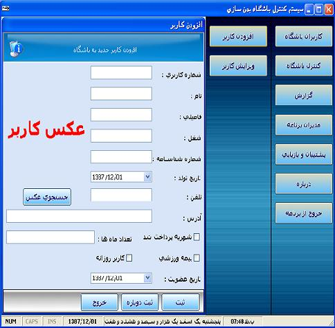



## Control GYM Club System With MS Access Database In Persian \( Farsi \)

### Description

This Sample Is Good Source For Learning How To Programming With Visual Basic And MS Access .

This Program Can Control Users,Admin,User,Monthly Salary And ...

This Application Is Finishid And Not Defective .

Password For Login Tu System : 123456
 
### More Info
 

             |
---                |---
**Submitted On**   |2009-02-19 19:45:26
**By**             |[Araz Jafaripur](https://github.com/Planet-Source-Code/PSCIndex/blob/master/ByAuthor/araz-jafaripur.md)
**Level**          |Advanced
**User Rating**    |5.0 (10 globes from 2 users)
**Compatibility**  |VB 5\.0, VB 6\.0, ASP \(Active Server Pages\) , VBA MS Access
**Category**       |[Databases/ Data Access/ DAO/ ADO](https://github.com/Planet-Source-Code/PSCIndex/blob/master/ByCategory/databases-data-access-dao-ado__1-6.md)
**World**          |[Visual Basic](https://github.com/Planet-Source-Code/PSCIndex/blob/master/ByWorld/visual-basic.md)
**Archive File**   |[Control\_GY2144702212009\.zip](https://github.com/Planet-Source-Code/araz-jafaripur-control-gym-club-system-with-ms-access-database-in-persian-farsi__1-71799/archive/master.zip)

